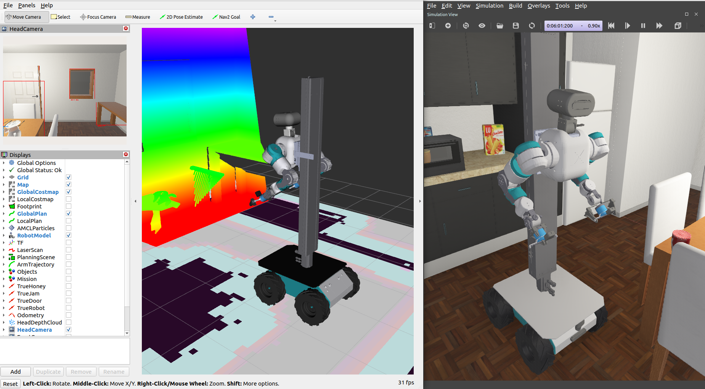
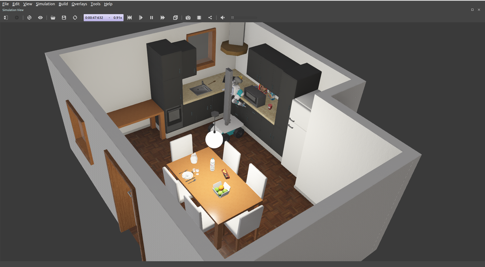
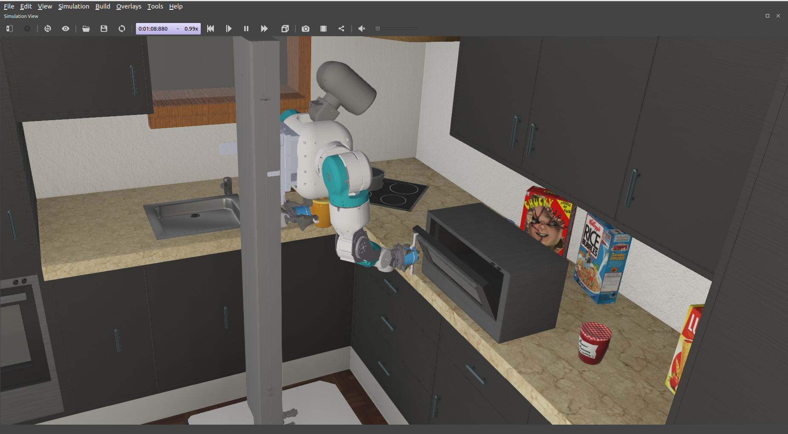
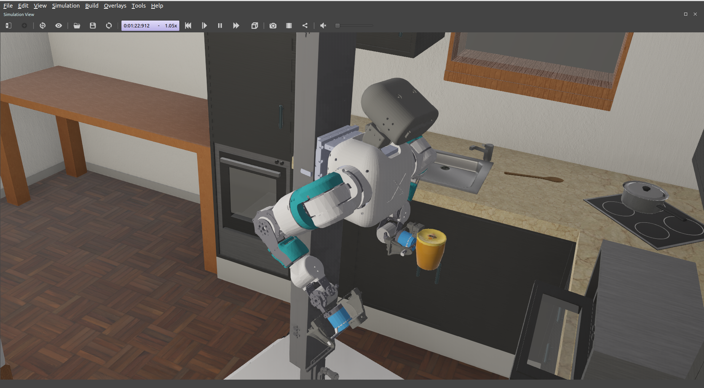
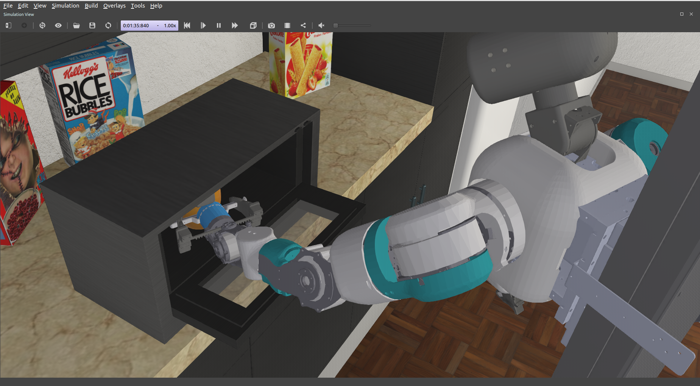
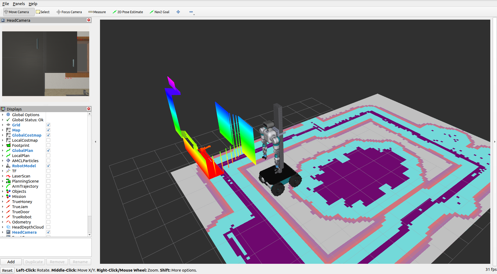
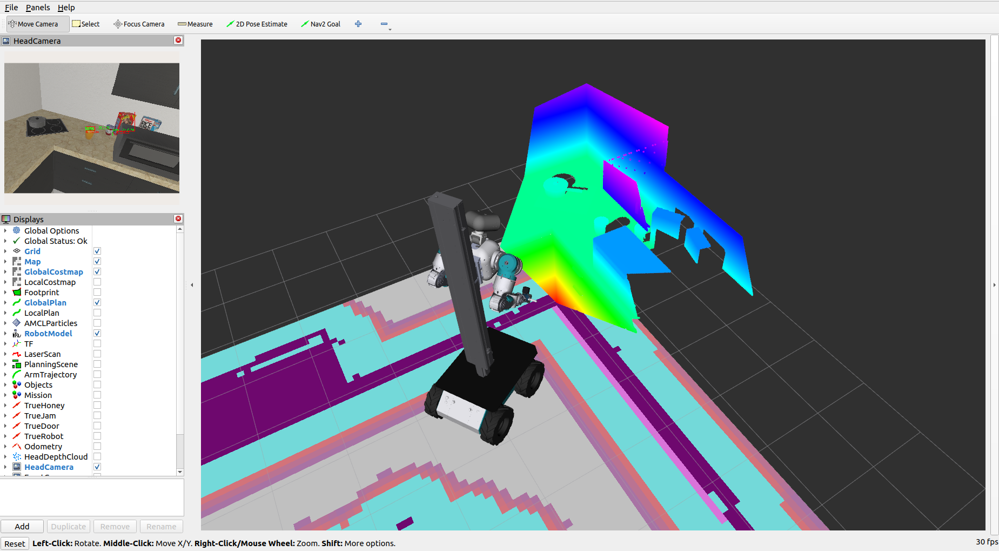

# mrRobot: a wheeled humanoid in a Webots kitchen



A ROS 2 Humble + Webots R2025a simulation of a wheeled humanoid: the OpenFleX
upper body (a lift column, two 7-DOF OpenArmX arms with two-finger hands, and a
pan-tilt head with an RGB-D camera) on a Clearpath Husky A200 base. It runs a
kitchen errand on its own: it finds a honey jar, opens the microwave with one
hand while holding the jar in the other, puts the jar in and shuts the door,
then carries a jam jar to the dining table. It uses `ros2_control`, MoveIt 2,
Nav2 with AMCL and a scan-matching relocalizer, `robot_localization`, and a
colour detector on the head camera.

| The kitchen | Opening the microwave |
|---|---|
|  |  |

## Quick start

Build the workspace first (see [Build](#build)), then:

```bash
ros2 launch mrrobot_bringup mrRobot.launch.py mission:=true
```

This starts Webots on the kitchen world, the ROS 2 driver and the eight
controllers, localization, Nav2, MoveIt and the perception nodes, and opens
RViz. The errand starts by itself once everything answers (about 15 s after
launch) and takes about three and a half minutes.

| Argument | Default | Effect |
|---|---|---|
| `mission` | `false` | Run the errand in `mission_file` once the stack is up |
| `mission_file` | `kitchen_errand.yaml` | The errand to run (from `mrrobot_control/config/missions`) |
| `gui` | `true` | Webots' 3D window; with `false` the cameras still render |
| `rviz` | `true` | RViz with the mrRobot layout |
| `headless` | `false` | Webots without rendering, in fast mode, and no RViz |
| `localization` | `amcl` | What publishes `map -> odom`: `amcl`, `slam` or `none` |
| `nav` | `true` | The Nav2 servers |
| `moveit` | `true` | `move_group` |
| `perception` | `true` | The colour detector and the object memory |
| `world` | `mrRobot.wbt` | World file in `mrrobot_webots/worlds` |

Without `mission:=true` the robot waits in the kitchen and can be driven and
posed by hand:

```bash
ros2 topic pub --once /mrRobot/posture std_msgs/String "data: ready"   # stow, tuck, carry, ready
ros2 topic pub --once /mrRobot/gripper std_msgs/String "data: open"    # open, close
ros2 run teleop_twist_keyboard teleop_twist_keyboard \
    --ros-args -r /cmd_vel:=/base_controller/cmd_vel_unstamped   # ros-humble-teleop-twist-keyboard
```

The model on its own, in RViz with joint sliders and no simulator:

```bash
ros2 launch mrrobot_description view_robot.launch.py
```

## The errand

[kitchen_errand.yaml](src/mrrobot_control/config/missions/kitchen_errand.yaml)
is a list of steps, each a verb of the mission node
([mission_node.py](src/mrrobot_control/mrrobot_control/mission_node.py)). The
same file holds the objects (with where the errand expects them, since the
kitchen has two jam jars), the fixtures, the planning-scene boxes, the stations
the base docks at, and the retry counts. A different errand is a different file
(`mission_file:=...`).

| # | Step | What happens | Time (s) |
|---|---|---|---|
| 1 | `posture tuck` | Both arms folded, column at mid travel | 5.8 |
| 2 | `goto honey` | Drive to the honey jar's station, the head kept on the jar | 14.9 |
| 3 | `find honey` | The object memory already has it from the drive | 0.0 |
| 4 | `pick honey`, left hand | Fresh detection from the dock, reach, grasp, carry pose | 26.3 |
| 5 | `goto microwave` | Straight back to the door's standoff | 7.4 |
| 6 | `door open`, right hand | Wrist camera measures the door, grip the handle, pull it open | 17.8 |
| 7 | `goto microwave_in` | Back out and curve in, facing the counter about 26 deg to the right | 9.7 |
| 8 | `place microwave_in`, left hand | The jar goes in over the open door; the hand leaves the way it came | 19.2 |
| 9 | `goto microwave` | Turn back square to the door | 4.9 |
| 10 | `door close`, right hand | The fist lifts the door by its face and presses it shut | 25.7 |
| 11 | `goto jam` | Hop along the counter to the jam jar | 21.1 |
| 12 | `find jam` | Already seen | 0.0 |
| 13 | `pick jam`, left hand | As for the honey | 22.4 |
| 14 | `goto table` | Hop to the corner of the dining table | 22.4 |
| 15 | `place table_spot`, left hand | Set the jar down on the table | 15.2 |
| 16 | `posture tuck` | | 1.6 |

The times are from one run on the current code (214.3 s in total).

| Carrying the honey with the door open | Placing it in the microwave |
|---|---|
|  |  |

The mission never uses the simulator's ground truth to act. The ground truth is
recorded next to it to judge the result: where both jars ended up, whether the
door is shut, and whether every step succeeded on its first attempt (see
[Results](#results)).

What the verbs do:

- **goto**: both arms home (a hand holding a jar carries it level in front of
  its shoulder, lightly pinched) and the head's gaze on the station's target.
  The dock is worked out from where the target really is: a jar from what the
  camera sees, a fixture from the map, a handle bar at whatever point along it
  lines the dock up with where the base already is. Then one of: straight
  along the dock's line, a turn on the spot onto the line and straight along
  it, back out for a run-up and curve in, or a hop to a run-up point and a
  curve in (Nav2 for anything further than 1.5 m). On the dock, the camera
  (jars) or a scan match (fixtures) confirms the pose, or the base comes in
  again.
- **find**: the object memory answers from the last two seconds, else aims the
  head at where the errand expects the object, else sweeps the head.
- **pick**: a fresh detection from the final pose, so the localization error
  cancels out; arm and column move together to above the pre-grasp point, the
  column lowers the hand onto it, then straight in, close, check the fingers
  (an empty hand closes further than one on a jar), lift, straight back, and
  home.
- **door**: see [Manipulation](#manipulation).
- **place**: a pick in reverse. A hand that has lost its jar ends the errand
  there.

Every verb has its own retry: `goto` clears the costmaps and backs out first,
`find` sweeps again, `pick` finds the object again, `door` and `place` come in
again. An arm that MoveIt cannot move is walked out joint by joint, and a jar
that is already down is never put down twice.

## Packages

| Package | Contents |
|---|---|
| `mrrobot_description` | URDF/xacro of the whole robot (base, OpenFleX modules, sensors), base and sensor meshes, RViz layout |
| `mrrobot_webots` | Kitchen world, a microwave PROTO with a working door, and the script that generates the robot's PROTO from the URDF at build time |
| `mrrobot_control` | `ros2_control` configuration, arm kinematics, navigation and arm skills, the mission node and its errands |
| `mrrobot_navigation` | EKF, scan filter, maps, AMCL, scan relocalizer, Nav2 and SLAM configuration |
| `mrrobot_moveit_config` | SRDF, kinematics, OMPL and controller configuration, `move_group` launch |
| `mrrobot_perception` | Colour detector, object memory with head search, ground-truth plugin |
| `mrrobot_msgs` | `FindObject` service |
| `mrrobot_bringup` | The launch file that starts everything, and the launch test |
| `third_party/openarmx_description` | OpenArmX arms and hands (OpenFleX) |
| `third_party/openarmx_head_description` | OpenArmX pan-tilt head (OpenFleX) |
| `third_party/lift_slide_description` | Lift column (OpenFleX) |
| `third_party/pymoveit2` | Python client for MoveIt 2 |

The packages in `src/third_party/` come from other projects and keep their own
licenses. [src/third_party/README.md](src/third_party/README.md) lists where
each one comes from and the few changes made to them.

## Build

Requires Ubuntu 22.04, ROS 2 Humble and Webots R2025a.

```bash
git clone https://github.com/ali-pahlevani/Mr_Robot.git ~/mrRobot_ws
cd ~/mrRobot_ws
rosdep update
rosdep install --from-paths src --ignore-src -r -y
colcon build
source install/setup.bash
```

`rosdep` installs everything else from apt: `webots_ros2`, `ros2_control` and
its controllers, MoveIt 2, Nav2, `robot_localization`, `slam_toolbox`, OpenCV
and NumPy. The Python packages are installed as copies, so rebuild after
editing them.

### Webots

Install [Webots R2025a](https://github.com/cyberbotics/webots/releases/tag/R2025a)
(the `.deb` installs to `/usr/local/webots`). If Webots lives anywhere else,
point `WEBOTS_HOME` at it before launching:

```bash
export WEBOTS_HOME=~/webots
```

The world loads some of its furniture from the Webots asset server the first
time it runs, so the first launch needs an internet connection.

---

## Robot

| Part | Description | Joints |
|---|---|---|
| Base | Clearpath Husky A200 at 0.85 scale: 0.84 x 0.57 m, wheel radius 0.140 m, track 0.472 m, skid-steer | four wheels as one differential drive |
| Lift column | 1.15 m of travel (0.75 m down, 0.40 m up about mid travel), its foot on the base's top plate | `lift_joint` |
| Arms | Two 7-DOF OpenArmX arms, 0.68 m reach from the shoulder | `openarmx_{left,right}_joint1..7` |
| Hands | Two-finger grippers, 0.070 m travel per finger, tool point 0.08 m out from the hand | `openarmx_{left,right}_finger_joint1` (`2` is a mimic) |
| Head | Pitch and yaw, with an RGB-D camera in its face | `openarmx_head_{pitch,yaw}_joint` |

The base is built from Clearpath's dimensions multiplied by `base_scale` in
[mrRobot.urdf.xacro](src/mrrobot_description/urdf/mrRobot.urdf.xacro), which is
the only number that says so. The OpenFleX body above the plate is not scaled,
which is why the height of the column's foot is derived from the plate's top
face rather than scaled, and why the lidar's mount is derived from the plate's
underside: a lidar does not shrink with the chassis.

### Sensors

| Sensor | Where | Spec | Topics | Rate |
|---|---|---|---|---|
| Lidar (SICK TiM class) | Under the top plate, 0.35 m ahead of `base_link` | 190 deg, 270 rays, 0.12-25 m | `/scan`, `/scan_filtered` | 9 Hz |
| IMU | Inside the chassis | Orientation, rate, acceleration | `/imu` | 120 Hz |
| Front RGB-D (D455 class) | Front panel | 87 deg, 640x480, 0.05-8 m | `/front_camera/*`, `/front_depth/*` | 10 Hz |
| Head RGB-D (D455 class) | In the head's face, pans and tilts with it | 87 deg, 640x480, 0.1-6 m | `/head_camera/*`, `/head_depth/*` | 15 Hz |
| Wrist RGB-D x2 (D405 class) | On each palm, looking along the fingers | 60 deg, 640x480, 0.05-5 m | `/{left,right}_wrist_camera/*`, `/{left,right}_wrist_depth/*` | 5 Hz |
| Ground truth | Webots supervisor | True poses of the robot and both jars, the microwave door's angle | `/ground_truth/*` | 10 Hz |

The sensors are full size; only their mounts moved with the smaller chassis.
Camera frames follow the Webots convention (x forward), and each has a
`*_optical_link` child with the ROS optical rotation. The depth image of each
RGB-D pair shares its colour camera's pose, field of view and resolution, so a
pixel in one is the same pixel in the other.

## Simulation

The world gives the robot `controller "<extern>"`, so Webots waits for a
controller to connect. The launch file connects `webots_ros2_driver` to it,
which reads the `<webots>` block in the URDF to decide which devices to
publish and loads `webots_ros2_control`, so every Webots motor is a
`ros2_control` joint and the standard controllers work as they would on
hardware.

The robot's PROTO is generated from the URDF at build time
([build_proto.py](src/mrrobot_webots/scripts/build_proto.py)), so the
simulator's model cannot drift from the URDF. The script runs the Webots
importer on the expanded URDF and adds what the importer cannot know: the
sensors at their URDF frames, contact materials, collision meshes baked to
their scale, and boxes in place of two meshes that were too heavy to simulate.
To change the robot, edit the URDF and rebuild.

Three details in [mrRobot.launch.py](src/mrrobot_bringup/launch/mrRobot.launch.py)
matter more than they look. Each, left out, gives a stack that seems to start
and then does nothing:

1. **The driver connects over TCP.** `WebotsController` always picks IPC on
   Linux, and this Webots does not create an IPC endpoint; the driver then
   prints `Cannot connect to Webots instance` for 50 s and gives up. The launch
   builds the driver's command itself with `--protocol=tcp`.
2. **So does the supervisor.** Only `ros2_supervisor.py` publishes `/clock`, and
   its own launcher also hard-codes IPC. Without `/clock` every node on sim time
   stays at t=0 and every controller switch times out.
3. **The world is installed with absolute PROTO paths.** `WebotsLauncher` copies
   the world to `/tmp` before starting Webots, which breaks relative
   `EXTERNPROTO` paths, and the robot silently never loads.
   `mrrobot_webots/CMakeLists.txt` rewrites them at install time.

The ground-truth plugin
([ground_truth.py](src/mrrobot_perception/mrrobot_perception/ground_truth.py))
publishes `/ground_truth/{robot,honey,jam}` and `/ground_truth/microwave_door`.
Its `/ground_truth/contacts` service prints every contact point of the robot
in the driver's log, and `/ground_truth/snapshot`
(`"path.png,bearing_deg,distance_m"`) exports a picture of the scene looking
at the robot. Only the door check reads any of it; it is there to measure the
rest.

## Control

| Controller | Type | Joints |
|---|---|---|
| `joint_state_broadcaster` | JointStateBroadcaster | all |
| `base_controller` | DiffDriveController | four wheels, skid-steer |
| `lift_controller` | JointTrajectoryController | `lift_joint` |
| `head_controller` | JointTrajectoryController | head pitch and yaw |
| `left_arm_controller`, `right_arm_controller` | JointTrajectoryController | seven joints each |
| `left_gripper_controller`, `right_gripper_controller` | JointTrajectoryController | fingers |

One process
([spawn_controllers.py](src/mrrobot_control/mrrobot_control/spawn_controllers.py))
brings the controllers up in order and checks each one's state before the next
step, instead of the stock spawner, which gives up for good when a `load`
reply is lost (about one start in ten).

**The drivetrain is measured, not scaled.** `wheel_separation_multiplier` is
1.655 (two whole turns at 0.5 rad/s against ground truth, so the acceleration
ramps are 1% of the arc) and the wheel radius multipliers are 1.0 (a 0.4 m leg
sampled at rest at both ends). The numbers and how they were measured are in
[mrRobot_controllers.yaml](src/mrrobot_control/config/mrRobot_controllers.yaml).

**The two hands have different fingers.** In Webots a blocked position motor
pushes with its whole force limit, so two fingers closed on a jar were two
saturated pushes with nothing centring the jar, and it walked out of the pads.
The left hand, which carries the jars, has effort-controlled fingers that act
as a spring (200 N/m), so a jar pushed off centre is pushed back. It pinches a
jar at 98 N while its own arm works, and at 29 N while the base drives or the
other hand opens the door: a hard pinch on the jar made the skid-steer's turns
walk the base 8-20 cm, and the jolt of the door coming open could snap the
tensed fingers past their stop and throw the jar. The right hand, which works
the door, keeps stiff position control, held to 20 N so the pull does not jolt
the robot.

## Localization

The EKF ([ekf.yaml](src/mrrobot_navigation/config/ekf.yaml)) fuses the wheel
odometry's velocity with the IMU's heading, which is the world's heading, so
`odom` is aligned with the map and never turns. The diff-drive controller's
pose is exact but its twist came out 6-7% fast (it divides by the time between
two updates of the `/clock` it last received, which jitters), so
[odom_rate.py](src/mrrobot_navigation/scripts/odom_rate.py) re-derives the
velocity from the pose over 0.12 s. The filtered pose now matches the ground
truth to a millimetre on straight legs.

AMCL publishes `map -> odom` on its own map, `kitchen_surface`: the SLAM map
thinned to the cells the lidar can actually see. On the full map, with walls
2-3 cells thick, a beam ending anywhere inside a wall scored as well as one on
its face, and the estimate slid along the counters by up to 14 cm.

**The scan relocalizer** ([scan_relocalize.py](src/mrrobot_navigation/scripts/scan_relocalize.py),
`/relocalize`) makes the estimate good wherever the mission needs it: it slides
the current scan over the map, keeps the best fit, and re-seeds AMCL there.
Three things make it trustworthy:

- It fits position only and takes the heading from the odometry, which is the
  IMU's. Searched, the heading came out 0.5 deg off near the table, a
  centimetre at the hand.
- It accepts a fit by how well it is pinned down, not only by its score. By
  the dining table the lidar sees chair legs that are not on the map, so the
  best fit scores 4-5 cm yet lands within a centimetre of the truth; facing the
  counter at an angle, the north counter falls behind the lidar and the fit can
  slide 7-9 cm along the east counter while scoring 2 cm. The relocalizer
  measures how much worse a fit gets moved 3 cm along its weakest direction
  and applies a passable fit only if that is at least 0.35 cm.
- For the first minute it watches `map -> odom`: in about one start-up in
  five AMCL's first estimate comes out a quarter turn wrong, and it re-seeds
  AMCL with the odometry's heading when it sees that.

**Where the scan cannot be trusted, the mission dead-reckons**: from the last
accepted match, on the odometry plus a model of how far each turn slides the
base sideways, which the wheels cannot see. The microwave's cavity is faced at
an angle, so its dock is matched square-on before the approach and reached on
dead reckoning.

Measured against ground truth, the relocalizer's matches are within 1 cm of the
truth wherever it accepts them (0.1 cm mean offset over 38 matches). The maps,
how they were made and corrected, are described in
[maps/README.md](src/mrrobot_navigation/maps/README.md).

## Navigation and docking

Everything the errand does is short and close to furniture, so Nav2 only
handles moves longer than 1.5 m. Between stations the base hops: a turn on
the spot towards a point, a straight drive, and a turn to the final heading,
all on odometry.

**A turn on the spot is not a turn about `base_link`.** A skid-steer scrubs all
four wheels, and a 70-118 deg turn pivots about a point 8.4 +- 0.8 cm behind
`base_link`, which moves the base about 12 cm on a quarter turn without the
wheels noticing. `hop_to` aims the straight leg so that the turns before and
after it land the base on its target. Smaller rotations slide further: 29-33
deg, on the spot or along a curve, moved the base 7.6-8.9 cm sideways.

**Docking is one forward curve.** The approach
([nav.py](src/mrrobot_control/mrrobot_control/nav.py)) steers onto the dock's
line with terminal guidance: at every step, the cubic that reaches the line
with the dock's heading, and the curvature it starts with, never tighter than a
0.4 m radius. The goal is taken in the odometry frame so that AMCL's small
jumps while moving cannot drag it about, and the odometry is sent short of the
goal by the sideways slide the curve's rotation will cause.

**A station** in the errand's YAML is a target (an object or a fixture) and
where that target must sit relative to the base, `at: [ahead, left]`, with a
heading. The numbers come from where each arm's grip has inverse kinematics:
the jars 0.77 m ahead and 0.37 m to the left, the door's handle 0.70 m ahead
and 0.10 m to the right. Options:

| Option | Used by | Effect |
|---|---|---|
| `slide: [lo, hi]` | microwave door | The handle may be gripped anywhere along the bar within this range, chosen to keep the base in line |
| `headings: [lo, hi]` | microwave cavity | The dock may face any heading in this range; the one reached by a short back-out and one curve is chosen by simulating the approach |
| `relocalize: runup` | microwave cavity | Scan-match only at the run-up point and dead-reckon the dock |
| `runup`, `back_room` | jam jar | Shorter run-up for turning (dining chairs behind), more room for backing straight out |
| `leg_match: false` | jam jar | No scan match mid-hop, where the robot faces the far walls |

The microwave shows why `headings` exists: the door's handle has to be 0.1 m to
the right of the base for the right hand, and the cavity 0.36 m to the left for
the left hand. Square-on, that took two sideways hops each way. Faced about 26
deg to the right, the cavity is where the left hand wants it from almost the
same spot, and the base only turns back to close the door.

## Manipulation

Every arm motion is planned by MoveIt against a scene the mission builds: the
counters, the microwave as five slabs around its cavity, the open door and its
handle bar, the table, and the jar in the hand as an attached box. The scene is
re-expressed in `base_link` after every docking. Straight moves are Cartesian
paths, retimed to the requested speed (Humble's Cartesian path service ignores
velocity scaling) and rejected if the IK flips configuration between two
points.

**Reaching down onto a target raises the column instead of hovering.** A
planned swing dips a few centimetres below its plan, and there is little IK
above a pre-grasp point. So the arm takes the target's own pose with the column
higher, and lowering the column brings the hand straight down. Before this, the
wrist caught the worktop's edge on the way to a pick, and the honey jar caught
the open door's tip. For the swing out, the fingers are shut, so that the
worktop's edge cannot get between them.

**The door handle is measured with the wrist camera.** The bar is 10 mm thick
and stands 5 mm clear of a door face the fingertips must not touch, and one to
three centimetres of localization error decides between a grip and a jam. At
the pre-grasp pose, 12 cm back, the right wrist's depth camera (whose optical
axis is the hand's approach axis) reads the distance to the door panel and the
height of the bar, and the hand goes in to leave 7 mm of air between the
fingertips and the panel. A grip counts only if the fingers stop on the bar.
The hand then pulls the door open along its arc, lets go, and the base backs
away 12 cm so the finger slides out from under the door instead of lifting it.

**The door is closed with the fist**, pitched up 15 deg, lifting the flat door
by its face around the hinge and pressing it home. The door's centre of mass
is over the hinge, so it falls open again from anything over 3 deg; the push
goes a little past closed. A push step with no straight path is tried again
with the column exactly at its share of the rise, and then skipped.

**Into the microwave**, the cavity is 18.6 cm tall and the jar 11.5 cm, with
the open door's handle bar hanging just below the mouth. The arm takes the
mouth's pose with the column 15 cm higher so the jar swings in over the open
door, the column lowers it onto the mouth, and it goes in straight. The open
hand leaves by the joint path it came in on, run backwards: nothing new is
planned inside the cavity, where a fresh straight path out failed one time in
two.

## Perception

The colour detector ([color_detector.py](src/mrrobot_perception/mrrobot_perception/color_detector.py))
finds the jars by colour (HSV) in the head camera and places them in 3D with
the aligned depth image, five times a second. A frame whose camera transform
has not arrived yet is retried on the next tick rather than dropped. The object
memory ([object_memory.py](src/mrrobot_perception/mrrobot_perception/object_memory.py))
keeps the latest position of each object and answers `/object_memory/find`
(`mrrobot_msgs/srv/FindObject`), aiming the head at where the object is
expected or sweeping it when needed. A detection needs two agreeing frames
within 5 cm, and only detections near where the errand expects the object
count, since the kitchen has two jam jars.

The camera's own error is 0.6-1.4 cm in the robot's frame. For the grasp, the
jar is seen again from the final pose, so the localization error cancels out.

## RViz

The RViz layout shows the map with both costmaps, Nav2's plans, the AMCL
particles, the filtered scan, MoveIt's planning scene and trajectories, the
objects the robot has found, the mission's current step over the robot, the
ground truth, and the cameras with their detections.

| At the dining table | At the counter |
|---|---|
|  |  |

## Results

Three complete runs in a row on the current code, judged against the
simulator's ground truth:

| | Result |
|---|---|
| Steps succeeded on the first attempt | 16 of 16 in every run, with no second try inside any step |
| Time, first step to last | 210-216 s, mean 213 s |
| Honey jar | on the microwave floor, 1.2-2.8 cm from the cavity's centre (mean 1.8 cm) |
| Jam jar | on the table, 1.4-2.0 cm from its spot (mean 1.7 cm) |
| Microwave door | shut in every run |

The mission node's log of the first of these runs is in
[docs/logs/errand_done.log](docs/logs/errand_done.log).

## Tests

```bash
colcon test
colcon test-result --verbose
```

- `mrrobot_control`: the arm kinematics against the URDF's joint table, the
  door probe on synthetic wrist-camera frames (panel, handle bar and cavity),
  the navigation geometry (turn pivots against measured turns, the odometry
  frame conversions, the approach guidance), and flake8.
- `mrrobot_moveit_config`: the SRDF's groups and chains against the URDF.
- `mrrobot_perception`: the colour detector's gates.
- `mrrobot_bringup`: the whole stack headless. The clock ticks, all eight
  controllers become active, Nav2 drives the robot to the honey station, and
  the detector reports the honey jar within 25 cm of where it stands. It runs
  Webots headless in fast mode and takes under a minute.

---

## Known limitations

- **Simulation only.** There is no hardware interface; the robot exists as the
  URDF and the Webots model generated from it.
- **One kitchen.** The stations, the scene boxes and the maps are made for this
  world. A new errand in the same kitchen is only a YAML file, but a new room
  needs a new map, and the stations need placing for the arms' IK.
- **Narrow IK.** The forward jar grip has IK only 12-16 cm outboard of the
  working shoulder, and the door grip only 0.22-0.37 m below it. The stations
  are placed for these bands, so a dock that ends up a few centimetres off
  costs a second approach now and then.
- **The map's far side.** The map was built by driving around the kitchen, so
  the walls and furniture far from the counters are drawn less accurately. The
  mission does not scan-match facing them.
- **Internal recoveries.** A door push or a planned move occasionally needs a
  second try inside the same step; the step still succeeds.
- **Licenses.** The OpenFleX packages are CC BY-NC-SA 4.0, which does not allow
  commercial use (see [src/third_party/README.md](src/third_party/README.md)).

## Troubleshooting

- **`Cannot connect to Webots instance` from the driver:** another Webots is
  probably running on port 1234. Close it and launch again.
- **RViz fails with `undefined symbol: __libc_pthread_init`:** this happens when
  launching from a snap-packaged terminal such as VS Code's. The launch file
  clears the snap variables for RViz; when running `rviz2` by hand, prefix it
  with `GTK_PATH= LOCPATH= GIO_MODULE_DIR=`.
- **The world file does not open in Webots on its own:** the robot's PROTO is
  generated at build time and the installed world points to it. Start it
  through the launch file.
- **The camera overlays cover Webots' 3D view:** switch them off in the
  Overlays menu, or set `hideAllCameraOverlays` and
  `hideAllRangeFinderOverlays` in `~/.config/Cyberbotics/Webots-R2025a.conf`.

Useful commands:

```bash
ros2 control list_controllers
ros2 topic echo /ground_truth/honey --once
ros2 service call /relocalize std_srvs/srv/Trigger
```

## License

The mrRobot packages are released under the MIT License (see [LICENSE](LICENSE)).
The packages in `src/third_party/` and the meshes in
`src/mrrobot_description/meshes/` keep their own licenses: the OpenFleX
packages are CC BY-NC-SA 4.0, `pymoveit2` is BSD-3-Clause, and the base and
sensor meshes carry their license files next to them.

## Maintainer

Ali Pahlevani ([a.pahlevani1998@gmail.com](mailto:a.pahlevani1998@gmail.com)),
[github.com/ali-pahlevani/Mr_Robot](https://github.com/ali-pahlevani/Mr_Robot)
